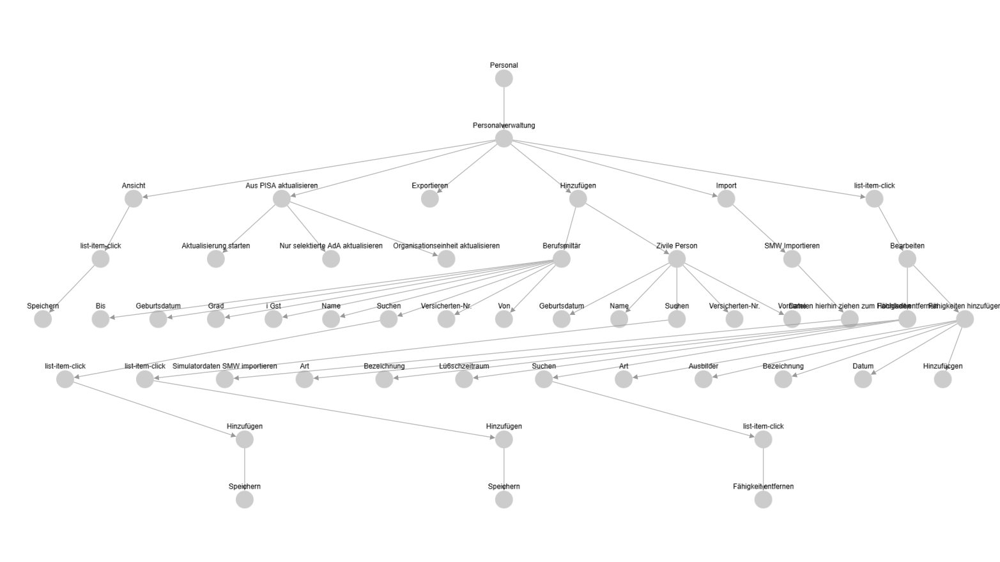

# Web-UI-Tree-Builder

This repository helps you capture and visualize the structure of web UIs as a simple tree.

What it does (in short):

- A small bookmarklet adds a lightweight overlay to any page. You can click elements on the page, and those clicks are turned into "actions" with a path and label.
- A local Python server receives the actions, writes them to JSONL files, and serves a live UI tree in the browser.
- The tree view updates after each action. You can remove nodes directly in the tree view (press Delete on a selected node) and the view refreshes.

Main parts of the repo:

- `bookmarklet/` – TypeScript project that builds the bookmarklet. It shows a tiny panel and lets you pick elements on the current page; selections are POSTed to the server (`/update-tree`).
- `tree_host/` – FastAPI app that:
  - Serves the tree view at `/` using Cytoscape.js.
  - Accepts updates at `/update-tree` and stores them in `./data/*.jsonl`.
  - Listens for deletes at `/delete` and removes a node (and its children) from stored data.
  - Uses a WebSocket to reload the page when data changes.

Notes:

- This is a local, developer-oriented tool. Data is stored as newline-delimited JSON under `tree_host`'s `./data/` folder.
- The UI is basic on purpose; it’s meant to be practical and easy to modify.
